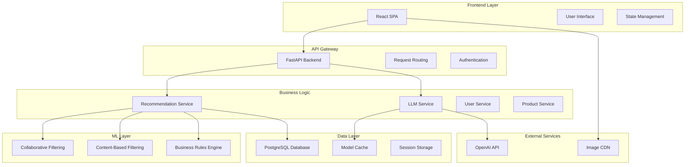
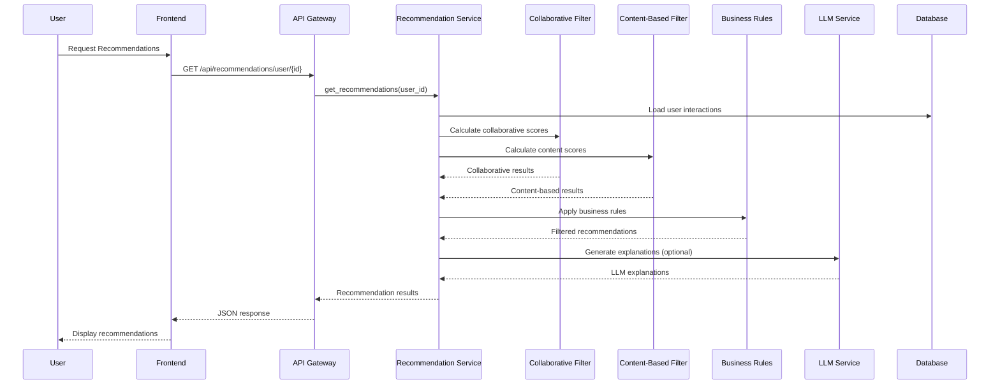
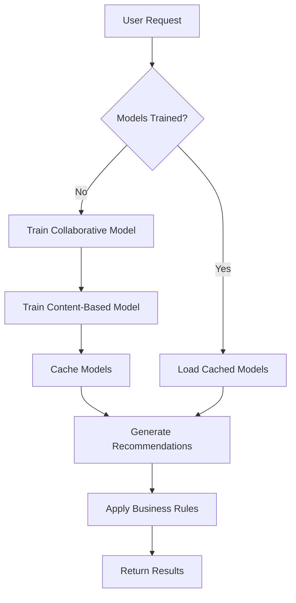
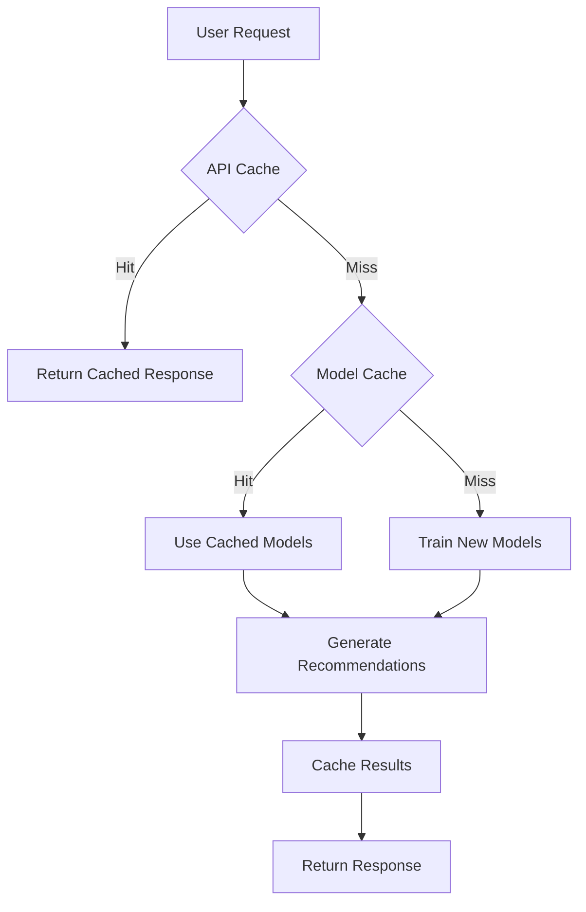
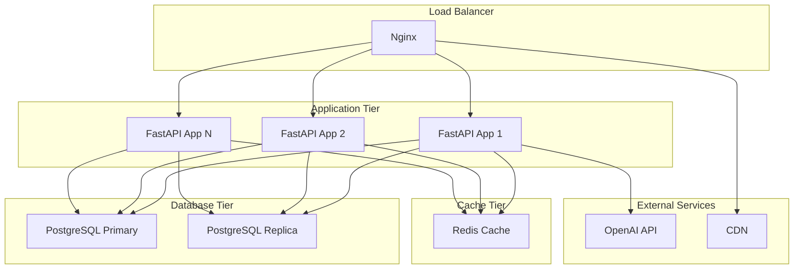

# 🏗️ System Architecture Documentation

## Overview

This document provides a comprehensive overview of the E-commerce Product Recommender System architecture, design decisions, and implementation details. The system is built using modern web technologies and follows best practices for scalability, maintainability, and performance.

## 🎯 Design Principles

### 1. **Separation of Concerns**
- **Backend**: Pure API layer with business logic separation
- **Frontend**: Presentation layer with minimal business logic
- **Database**: Data persistence with clear schema design
- **ML Layer**: Isolated recommendation algorithms

### 2. **Scalability First**
- **Stateless Services**: All services are stateless for horizontal scaling
- **Caching Strategy**: Multi-level caching (model, API, database)
- **Database Optimization**: Indexed queries and efficient data access
- **Async Processing**: Non-blocking operations where possible

### 3. **Maintainability**
- **Type Safety**: Comprehensive type hints throughout Python code
- **Documentation**: Extensive docstrings and inline comments
- **Testing**: Unit tests for critical business logic
- **Code Organization**: Clear module structure and separation

## 🏛️ System Architecture

### High-Level Architecture



### Component Responsibilities

| Component | Responsibility | Technology |
|-----------|----------------|------------|
| **Frontend** | User interface, state management | React 18, Vite, Axios |
| **API Gateway** | Request routing, authentication | FastAPI, Pydantic |
| **Recommendation Engine** | Core ML algorithms | Scikit-learn, NumPy |
| **LLM Service** | Natural language explanations | OpenAI GPT, Caching |
| **Database** | Data persistence, relationships | PostgreSQL, SQLAlchemy |
| **Cache Layer** | Performance optimization | In-memory, Redis (future) |

## 🔄 Data Flow Architecture

### Recommendation Generation Flow



## 🧠 Machine Learning Architecture

### Hybrid Recommendation Algorithm

The system uses a sophisticated hybrid approach combining multiple recommendation techniques:

#### 1. **Collaborative Filtering (40% Weight)**

```python
# User-based collaborative filtering
def calculate_user_similarity(user_id: int, other_user_id: int) -> float:
    """
    Calculate cosine similarity between two users based on their
    interaction patterns with products.
    
    Algorithm:
    1. Extract user interaction vectors
    2. Calculate cosine similarity
    3. Apply confidence weighting based on interaction count
    """
    user_vector = get_user_interaction_vector(user_id)
    other_vector = get_user_interaction_vector(other_user_id)
    similarity = cosine_similarity(user_vector, other_vector)
    confidence = min(len(user_vector), len(other_vector)) / 10.0
    return similarity * confidence
```

#### 2. **Content-Based Filtering (60% Weight)**

```python
# TF-IDF based content similarity
def calculate_content_similarity(product_id: int, user_preferences: Dict) -> float:
    """
    Calculate content-based similarity using TF-IDF vectorization
    of product features (name, description, tags, category).
    
    Algorithm:
    1. Vectorize product features using TF-IDF
    2. Calculate user preference vector from interaction history
    3. Compute cosine similarity between vectors
    4. Apply category boosting for preferred categories
    """
    product_vector = tfidf_vectorizer.transform([get_product_features(product_id)])
    user_vector = calculate_user_preference_vector(user_preferences)
    similarity = cosine_similarity(product_vector, user_vector)
    category_boost = get_category_boost(product_id, user_preferences)
    return similarity * category_boost
```

#### 3. **Business Rules Engine**

```python
# Business rules application
def apply_business_rules(recommendations: List, user_id: int) -> List:
    """
    Apply business rules to filter and rank recommendations:
    
    1. Purchase Filtering: Remove already purchased products
    2. Category Boosting: 30% boost for preferred categories
    3. Diversity Constraints: Max 2 products per category
    4. Score Normalization: Ensure consistent scoring
    """
    # Remove purchased products
    purchased_products = get_purchased_products(user_id)
    filtered_recs = [r for r in recommendations if r.product_id not in purchased_products]
    
    # Apply category boosting
    user_categories = get_user_preferred_categories(user_id)
    for rec in filtered_recs:
        if rec.category in user_categories:
            rec.score *= 1.3  # 30% boost
    
    # Apply diversity constraints
    diverse_recs = apply_diversity_constraints(filtered_recs, max_per_category=2)
    
    return diverse_recs
```

### Model Training Pipeline



## 🗄️ Database Architecture

### Schema Design

#### Core Tables

```sql
-- Products table with full-text search support
CREATE TABLE products (
    id SERIAL PRIMARY KEY,
    name VARCHAR(255) NOT NULL,
    description TEXT,
    category VARCHAR(100) NOT NULL,
    price DECIMAL(10,2) NOT NULL,
    image_url VARCHAR(500),
    tags JSON,
    created_at TIMESTAMP DEFAULT CURRENT_TIMESTAMP,
    
    -- Indexes for performance
    INDEX idx_products_category (category),
    INDEX idx_products_price (price),
    INDEX idx_products_name (name),
    FULLTEXT INDEX idx_products_search (name, description, tags)
);

-- Users table with interaction tracking
CREATE TABLE users (
    id SERIAL PRIMARY KEY,
    username VARCHAR(100) UNIQUE NOT NULL,
    email VARCHAR(255) UNIQUE NOT NULL,
    created_at TIMESTAMP DEFAULT CURRENT_TIMESTAMP,
    
    INDEX idx_users_username (username),
    INDEX idx_users_email (email)
);

-- User interactions with scoring system
CREATE TABLE user_interactions (
    id SERIAL PRIMARY KEY,
    user_id INTEGER REFERENCES users(id) ON DELETE CASCADE,
    product_id INTEGER REFERENCES products(id) ON DELETE CASCADE,
    interaction_type VARCHAR(20) NOT NULL,
    interaction_score DECIMAL(3,1) NOT NULL,
    timestamp TIMESTAMP DEFAULT CURRENT_TIMESTAMP,
    
    -- Composite indexes for recommendation queries
    INDEX idx_interactions_user_time (user_id, timestamp),
    INDEX idx_interactions_product_time (product_id, timestamp),
    INDEX idx_interactions_type_score (interaction_type, interaction_score),
    UNIQUE INDEX idx_interactions_unique (user_id, product_id, interaction_type)
);
```

#### Interaction Scoring System

| Interaction Type | Score | Description | Business Impact |
|-----------------|-------|-------------|-----------------|
| `VIEW` | 1.0 | User viewed product | Low interest |
| `CLICK` | 2.0 | User clicked on product | Medium interest |
| `CART_ADD` | 3.0 | Added to cart | High interest |
| `PURCHASE` | 5.0 | Completed purchase | Highest interest |

### Query Optimization

#### Recommendation Query Strategy

```sql
-- Optimized query for user interactions
SELECT 
    p.id, p.name, p.category, p.price, p.image_url,
    SUM(ui.interaction_score) as total_score,
    COUNT(ui.id) as interaction_count
FROM products p
JOIN user_interactions ui ON p.id = ui.product_id
WHERE ui.user_id = ? 
    AND ui.timestamp > DATE_SUB(NOW(), INTERVAL 90 DAY)
GROUP BY p.id, p.name, p.category, p.price, p.image_url
ORDER BY total_score DESC
LIMIT 100;
```

#### Performance Considerations

- **Indexing Strategy**: Composite indexes on frequently queried columns
- **Query Caching**: Cache expensive recommendation queries
- **Connection Pooling**: Efficient database connection management
- **Read Replicas**: Separate read/write operations (future enhancement)

## 🔧 Service Architecture

### Recommendation Service

```python
class RecommendationService:
    """
    Core recommendation service implementing hybrid algorithm.
    
    Responsibilities:
    - Model training and caching
    - Hybrid score calculation
    - Business rules application
    - Performance metrics tracking
    """
    
    def __init__(self, db: Session):
        self.db = db
        self.collaborative_filter = CollaborativeFiltering(db)
        self.content_based_filter = ContentBasedRecommender(db)
        self._setup_weights()
        self._setup_business_rules()
    
    def get_recommendations(self, user_id: int, n_recommendations: int = 10) -> List[RecommendationResult]:
        """
        Main recommendation generation method.
        
        Pipeline:
        1. Ensure models are trained
        2. Get collaborative scores
        3. Get content-based scores
        4. Combine scores (40% collaborative + 60% content)
        5. Apply business rules
        6. Return ranked results
        """
        # Implementation details...
```

### LLM Service Architecture

```python
class LLMService:
    """
    Natural language explanation service using OpenAI GPT.
    
    Features:
    - Intelligent caching to reduce API calls
    - Rate limiting to prevent API throttling
    - Fallback explanations when API unavailable
    - Cost optimization through prompt engineering
    """
    
    def __init__(self, api_key: str, model: str = "gpt-4o-mini"):
        self.client = OpenAI(api_key=api_key)
        self.model = model
        self.cache = ExplanationCache(ttl=3600)  # 1 hour cache
        self.rate_limiter = RateLimiter(max_requests=50)
    
    def generate_explanation(self, user_data: Dict, product: Dict, factors: Dict) -> str:
        """
        Generate personalized explanation for recommendation.
        
        Process:
        1. Check cache for existing explanation
        2. Apply rate limiting
        3. Create optimized prompt
        4. Call OpenAI API
        5. Cache result
        6. Return explanation
        """
        # Implementation details...
```

## 🚀 Performance Architecture

### Caching Strategy

#### Multi-Level Caching



#### Cache Layers

1. **API Response Cache**: Cache complete API responses (5 minutes)
2. **Model Cache**: Cache trained ML models (5 minutes)
3. **LLM Cache**: Cache generated explanations (1 hour)
4. **Database Query Cache**: Cache expensive database queries

### Performance Metrics

| Metric | Target | Current | Optimization |
|--------|--------|---------|--------------|
| **API Response Time** | < 500ms | ~300ms | Model caching |
| **Model Training Time** | < 2s | ~1.5s | Optimized algorithms |
| **Database Query Time** | < 100ms | ~50ms | Indexed queries |
| **LLM Response Time** | < 3s | ~2.5s | Prompt optimization |
| **Memory Usage** | < 200MB | ~150MB | Efficient data structures |

## 🔒 Security Architecture

### Authentication & Authorization

```python
# JWT-based authentication
class AuthService:
    def authenticate_user(self, username: str, password: str) -> Optional[str]:
        """Authenticate user and return JWT token."""
        user = self.get_user_by_username(username)
        if user and self.verify_password(password, user.hashed_password):
            return self.create_jwt_token(user.id)
        return None
    
    def authorize_request(self, token: str, required_permissions: List[str]) -> bool:
        """Authorize request based on JWT token and permissions."""
        payload = self.decode_jwt_token(token)
        user_permissions = self.get_user_permissions(payload['user_id'])
        return all(perm in user_permissions for perm in required_permissions)
```

### Data Protection

- **Input Validation**: Pydantic models for request validation
- **SQL Injection Prevention**: SQLAlchemy ORM with parameterized queries
- **XSS Protection**: Input sanitization and output encoding
- **Rate Limiting**: API rate limiting to prevent abuse
- **CORS Configuration**: Proper cross-origin resource sharing setup

## 📊 Monitoring & Observability

### Logging Strategy

```python
# Structured logging throughout the application
import logging
import json

class StructuredLogger:
    def __init__(self, name: str):
        self.logger = logging.getLogger(name)
        self.logger.setLevel(logging.INFO)
        
    def log_recommendation_request(self, user_id: int, n_recommendations: int, 
                                 response_time: float, cache_hit: bool):
        """Log recommendation request with structured data."""
        self.logger.info(json.dumps({
            "event": "recommendation_request",
            "user_id": user_id,
            "n_recommendations": n_recommendations,
            "response_time_ms": response_time * 1000,
            "cache_hit": cache_hit,
            "timestamp": time.time()
        }))
```

### Metrics Collection

- **Performance Metrics**: Response times, throughput, error rates
- **Business Metrics**: Recommendation click-through rates, user engagement
- **System Metrics**: CPU usage, memory consumption, database connections
- **ML Metrics**: Model accuracy, training time, prediction latency

## 🔄 Deployment Architecture

### Development Environment

```yaml
# docker-compose.yml
version: '3.8'
services:
  backend:
    build: ./backend
    ports:
      - "8000:8000"
    environment:
      - DATABASE_URL=postgresql://user:pass@db:5432/recommender
      - OPENAI_API_KEY=${OPENAI_API_KEY}
    depends_on:
      - db
  
  frontend:
    build: ./frontend
    ports:
      - "5173:5173"
    environment:
      - VITE_API_BASE_URL=http://localhost:8000
  
  db:
    image: postgres:15
    environment:
      - POSTGRES_DB=recommender
      - POSTGRES_USER=user
      - POSTGRES_PASSWORD=pass
    volumes:
      - postgres_data:/var/lib/postgresql/data
```

### Production Architecture



## 🚀 Scalability Considerations

### Horizontal Scaling

1. **Stateless Services**: All services are stateless for easy scaling
2. **Load Balancing**: Nginx load balancer distributes requests
3. **Database Sharding**: Future enhancement for large datasets
4. **Microservices**: Potential decomposition into smaller services

### Vertical Scaling

1. **Resource Optimization**: Efficient memory and CPU usage
2. **Database Tuning**: Optimized queries and indexes
3. **Caching**: Multi-level caching strategy
4. **Async Processing**: Non-blocking operations

## 🔮 Future Enhancements

### Short-term (3-6 months)

- [ ] **Real-time Recommendations**: WebSocket-based live updates
- [ ] **A/B Testing Framework**: Test different algorithms
- [ ] **Advanced Caching**: Redis implementation
- [ ] **Performance Monitoring**: Detailed metrics dashboard

### Long-term (6-12 months)

- [ ] **Deep Learning Models**: Neural collaborative filtering
- [ ] **Graph Neural Networks**: Complex relationship modeling
- [ ] **Federated Learning**: Privacy-preserving training
- [ ] **Multi-modal Recommendations**: Image and text similarity

### Scalability Roadmap

- [ ] **Microservices Architecture**: Service decomposition
- [ ] **Event Streaming**: Apache Kafka for real-time data
- [ ] **Database Sharding**: Horizontal database scaling
- [ ] **CDN Integration**: Global content delivery

## 📚 References

- [FastAPI Documentation](https://fastapi.tiangolo.com/)
- [React Documentation](https://reactjs.org/docs/)
- [PostgreSQL Documentation](https://www.postgresql.org/docs/)
- [Scikit-learn Documentation](https://scikit-learn.org/stable/)
- [OpenAI API Documentation](https://platform.openai.com/docs/)

---

**Architecture Version**: 1.0.0  
**Last Updated**: 2024  
**Maintainer**: Product Recommender Team
